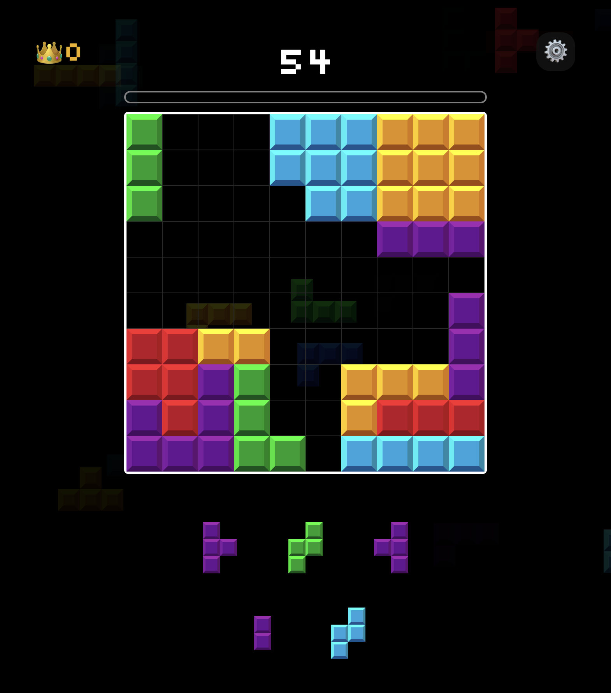
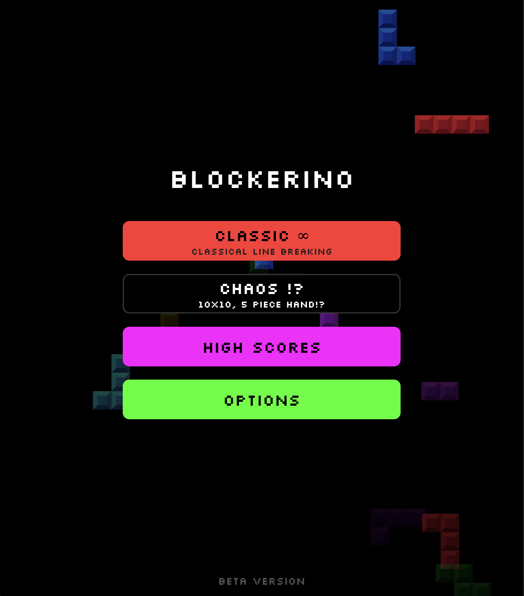

<div align="center">
  
# 🧩 Blockerino

**Увлекательная головоломка со сбором блоков на сетке 8x8 в стиле Block Blast.**  
*Размещайте блоки, разрывайте линии, набирайте очки и соревнуйтесь с друзьями!*

[](https://reactnative.dev/)
[](https://expo.dev/)
[](https://supabase.com/)
[](https://discord.com/developers/docs/activities/overview)

</div>

<br />

<div align="center">
  
  
</div>

<br />

## ✨ Особенности

- 🎮 **Кроссплатформенность**: Играйте на Веб-сайте, Android и iOS (создано на базе Expo).
- 💬 **Discord Activities**: Полная интеграция с Discord! Запускайте игру прямо в голосовых каналах через Embedded App SDK и соревнуйтесь с участниками сервера.
- 🏆 **Лидерборды и Мультиплеер**: Глобальные таблицы рекордов, синхронизация и многопользовательские функции (работает на базе Supabase).
- 📡 **Офлайн режим**: Играйте без интернета. Прогресс и рекорды синхронизируются автоматически, когда появится сеть.
- 🎨 **Современный UI/UX**: Красивые анимации, стильный темный дизайн и плавная работа.

---

## 🚀 Быстрый старт

### 1. Подготовка
Убедитесь, что у вас установлен [Node.js](https://nodejs.org/) (рекомендуется v18+).

### 2. Клонирование и установка
```bash
# Клонируем репозиторий
git clone https://github.com/Nerdlin/blockerino.git

# Переходим в папку проекта
cd blockerino

# Устанавливаем зависимости
npm install
```

### 3. Запуск локально
```bash
# Для запуска веб-версии:
npm run web

# Для запуска на Android / iOS (потребуется эмулятор или Expo Go):
npm start
```

---

## 👾 Интеграция с Discord Activities

Игра поддерживает запуск внутри Discord в виде Activity. Для тестирования локально:

1. Создайте приложение на [Discord Developer Portal](https://discord.com/developers/applications).
2. Создайте файл `.env` в корне проекта и добавьте ваш Client ID:
   ```env
   EXPO_PUBLIC_DISCORD_CLIENT_ID=ваш_client_id
   ```
3. Запустите веб-сервер и туннель:
   ```bash
   npm run web     # Запуск игры на порту 8081
   npm run tunnel  # Проброс порта через cloudflared
   ```
4. Укажите полученную HTTPS-ссылку от `cloudflared` в настройках "URL Mapping" вашего приложения в Discord Developer Portal.
5. Заходите в голосовой канал Discord и запускайте вашу Activity!

*(Для работы авторизации через Discord потребуется настройка [Supabase Edge Functions](./supabase/functions/discord-token-exchange/index.ts)).*

---

## 🛠 Технологический стек

- **Фреймворк**: [React Native](https://reactnative.dev/) / [Expo](https://expo.dev/) / [Expo Router](https://docs.expo.dev/router/introduction/)
- **База данных и Backend**: [Supabase](https://supabase.com/) (PostgreSQL, Auth, Edge Functions)
- **Стейт-менеджер**: [Jotai](https://jotai.org/)
- **Интеграции**: [Discord Embedded App SDK](https://github.com/discord/embedded-app-sdk)

---

<div align="center">
  <p>Создано с ❤️ пользователем Nerdlin</p>
</div>
