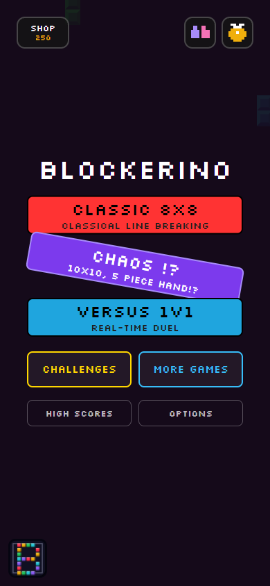
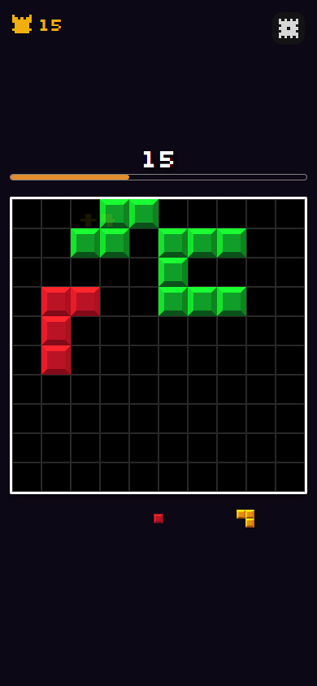
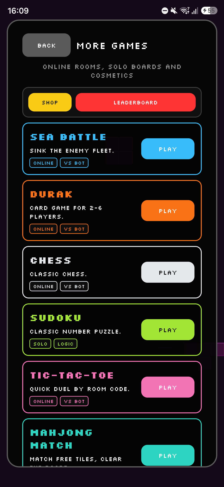
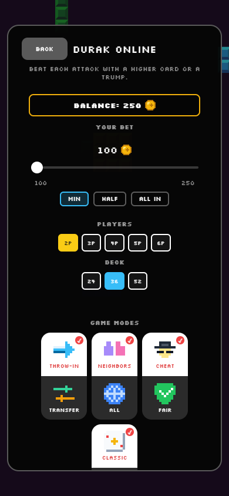

<div align="center">

# 🧩 BLOCKERINO

### Пиксельная головоломка в духе Block Blast: ставь фигуры, рви линии, лови комбо.

*Классика 8×8, хаос 10×10, дуэли 1 на 1, мини-игры и сезонные рейтинги, везде и со всеми.*

<br />

[](https://github.com/Nerdlin/blockerino/releases/tag/v1.0.9)
[](https://blockerino.aionerdlin.me)
[](https://discord.com/developers/docs/activities/overview)

[](https://reactnative.dev/)
[](https://expo.dev/)
[](https://supabase.com/)
[](https://www.typescriptlang.org/)

<br />

**[▶ Играть в браузере](https://blockerino.aionerdlin.me)** &nbsp;·&nbsp; **[📥 Скачать APK](https://github.com/Nerdlin/blockerino/releases/download/v1.0.9/blockerino-1.0.9.apk)** &nbsp;·&nbsp; **[📖 Что нового](./docs/release-1.0.9.md)**

<br />

<table>
  <tr>
    <td align="center"><br /><sub><b>Главное меню</b></sub></td>
    <td align="center"><br /><sub><b>Chaos 10×10</b></sub></td>
    <td align="center"><br /><sub><b>More Games</b></sub></td>
    <td align="center"><br /><sub><b>Durak Online</b></sub></td>
  </tr>
</table>

</div>

<br />

## 📲 Скачать (Android)

> **Последний релиз: [v1.0.9](https://github.com/Nerdlin/blockerino/releases/tag/v1.0.9)**, сборка 10.
> Исправления онлайн-игр (Sea Battle, Durak, шахматы), новые правила и вид Sea Battle, пиксельные масти в Durak и единый ник аккаунта в Versus и More Games.

| Файл | Размер | Для чего |
| --- | --- | --- |
| 📥 [**blockerino-1.0.9.apk**](https://github.com/Nerdlin/blockerino/releases/download/v1.0.9/blockerino-1.0.9.apk) | 50,0 МиБ | Установка на телефон |
| 📦 [**blockerino-1.0.9.aab**](https://github.com/Nerdlin/blockerino/releases/download/v1.0.9/blockerino-1.0.9.aab) | 68,7 МиБ | Google Play Console |

Подробности и история: [описание 1.0.9](./docs/release-1.0.9.md) · [все релизы](./docs)

> 💡 **Веб-версию** можно установить как приложение: в Chrome выберите «Установить» или «Добавить на главный экран».

---

## ✨ Что внутри

<table>
  <tr>
    <td width="50%" valign="top">

### 🎮 Режимы
- **Classic 8×8**: классический сбор линий.
- **Chaos 10×10**: поле больше, в руке 5 фигур.
- **Challenges**: ежедневный, Speed и Move Limit.
- **Versus 1v1**: дуэли в реальном времени с рейтингом Elo.

</td>
    <td width="50%" valign="top">

### 🏆 Рейтинги
- **Месячные сезоны** (UTC) и таблица «за всё время».
- **Топ‑10** подсвечен коронами и медалями.
- **Топ‑5** получает цветное имя и титул.
- Мягкий сброс Elo в конце сезона.

</td>
  </tr>
  <tr>
    <td width="50%" valign="top">

### 🃏 More Games
- **Sea Battle**: 10×10, ходишь снова при попадании.
- **Durak**: 2–6 игроков, переводной, шулеры, 24/36/52 карты.
- **Chess**, **Tic‑Tac‑Toe**: онлайн.
- **Sudoku** и **Mahjong**: соло.
- **Магазин**: фигуры, доски, скины, рубашки, темы.

</td>
    <td width="50%" valign="top">

### 🌐 Везде и всегда
- **Web, Android, iOS** на одной кодовой базе (Expo).
- **Discord Activities**: играйте прямо в голосовом канале.
- **Офлайн и PWA**: результаты синхронизируются, когда появится сеть.
- **RU / EN** интерфейс.

</td>
  </tr>
</table>

---

## 🚀 Быстрый старт

```bash
git clone https://github.com/Nerdlin/blockerino.git
cd blockerino
npm install
```

| Команда | Что делает |
| --- | --- |
| `npm run web` | Веб-версия на `localhost:8081` |
| `npm start` | Expo для Android / iOS (эмулятор или Expo Go) |
| `npm test` | Юнит-тесты (Jest) |
| `npm run lint` | Проверка кода |
| `npm run tunnel` | Проброс порта через cloudflared (для Discord) |

> Требуется [Node.js](https://nodejs.org/) v18+.

<details>
<summary><b>👾 Запуск как Discord Activity</b></summary>

<br />

1. Создайте приложение на [Discord Developer Portal](https://discord.com/developers/applications).
2. Добавьте Client ID в `.env` в корне проекта:
   ```env
   EXPO_PUBLIC_DISCORD_CLIENT_ID=ваш_client_id
   ```
3. Запустите веб-сервер и туннель:
   ```bash
   npm run web     # игра на порту 8081
   npm run tunnel  # проброс через cloudflared
   ```
4. Укажите HTTPS-ссылку от `cloudflared` в «URL Mapping» приложения Discord.
5. Зайдите в голосовой канал и запустите Activity.

Для авторизации через Discord нужна [Supabase Edge Function](./supabase/functions/discord-token-exchange/index.ts).

</details>

<details>
<summary><b>📦 Выпуск релиза</b></summary>

<br />

Порядок публикации версии (сборка APK/AAB, GitHub Release, обновление `app_config`) описан в [docs/release-process.md](./docs/release-process.md). Чек-лист ручной проверки: [docs/smoke-qa.md](./docs/smoke-qa.md).

</details>

---

## 🛠 Технологии

| | |
| --- | --- |
| **Клиент** | [React Native](https://reactnative.dev/) · [Expo](https://expo.dev/) · [Expo Router](https://docs.expo.dev/router/introduction/) · TypeScript |
| **Состояние** | [Jotai](https://jotai.org/) |
| **Backend** | [Supabase](https://supabase.com/): PostgreSQL, Auth, Realtime, Edge Functions |
| **Интеграции** | [Discord Embedded App SDK](https://github.com/discord/embedded-app-sdk) |
| **Тесты** | Jest (`jest-expo`) |

---

<div align="center">

Создано с ❤️ пользователем [Nerdlin](https://github.com/Nerdlin)

</div>
