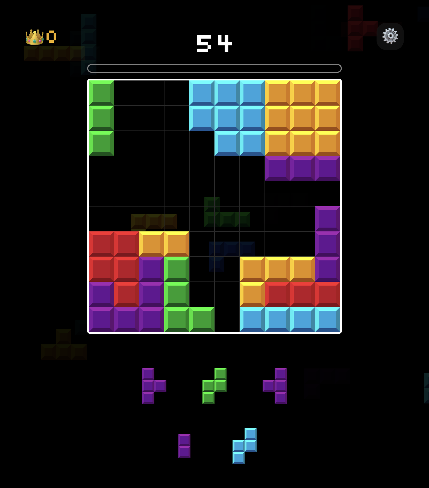

# blockerino: 8x8 grid, break lines!
Веб и мобильная игра-головоломка в стиле Block Blast. Размещайте блоки и разрывайте линии, чтобы получить очки.

#### Скриншот из игры
</img>
</img>

### Установка
1. Клонировать репозиторий
```bash
git clone https://github.com/Nerdlin/blockerino.git
```
2. Установить зависимости
```bash
npm install
```
3. Запустите сервер разработки
```bash
npm start
```
Blockerino использует Expo — для запуска можно использовать Expo Go, эмуляторы или веб-браузер.
